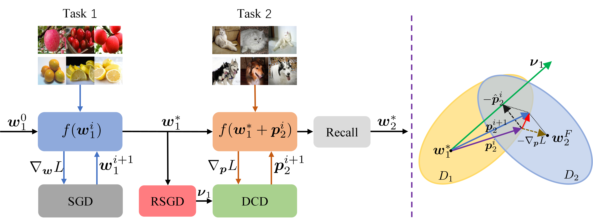

# PFCL: A Path-based Framework for Continual Learning

## 1. Abstract

  Continual learning often suffers from catastrophic forgetting.
  In contrast, humans can incrementally learn new information and recall learned knowledge.
  Most existing works follow the learning paradigm of finetuning from the minimum of the previous task so that the original memory is lost.
  In this work, we try to propose PFCL: a **P**ath-based **F**ramework for **C**ontinual **L**earning, which explicitly learns a constrained parameter path between tasks and travels back along the path to recall previous memories.
  Specifically, PFCL contains three components: a path-based model (PM), a direction-constrained descent (DCD) optimizer, and a path scaling strategy (Recall).
  To find the less forgetting direction, we study five candidates and validate that the spherically optimized direction is feasible.
  Ablative studies demonstrate the effectiveness of each component, and comparison experiments on four continual learning benchmarks show consistent improvements when adapting PFCL to three existing rehearsal-based methods.



## 2. Preparation

### Environment

```
conda create -n pfcl python=3.9
conda install pytorch torchvision torchaudio cudatoolkit=11.3 -c pytorch
pip install -r requirements.txt
conda activate pfcl
```

### Dataset

For MNIST and CIFAR100, run scripts will download datasets automatically.
- create a folder named "data" under the root of this project;
- put all datasets in this folder.

structure of files should be as follows:

    - data
        - cifar-100-python
            - meta
            - test
            - train
        - ImageNet
            - train
            - val
            - train.txt
            - train_100.txt
            - val.txt
            - val_100.txt
        - MNIST
            - processed
                - test.pt
                - training.pt
            - raw
                ...

In addition, you can create a soft link to existing datasets.

## 3. Reproduction

For baselines:
````
sh scripts/finetune.sh perMNIST rotMNIST CIFAR100 miniImageNet
````

For PFCL:
````
 sh scripts/pfcl.sh perMNIST rotMNIST CIFAR100 miniImageNet
````
